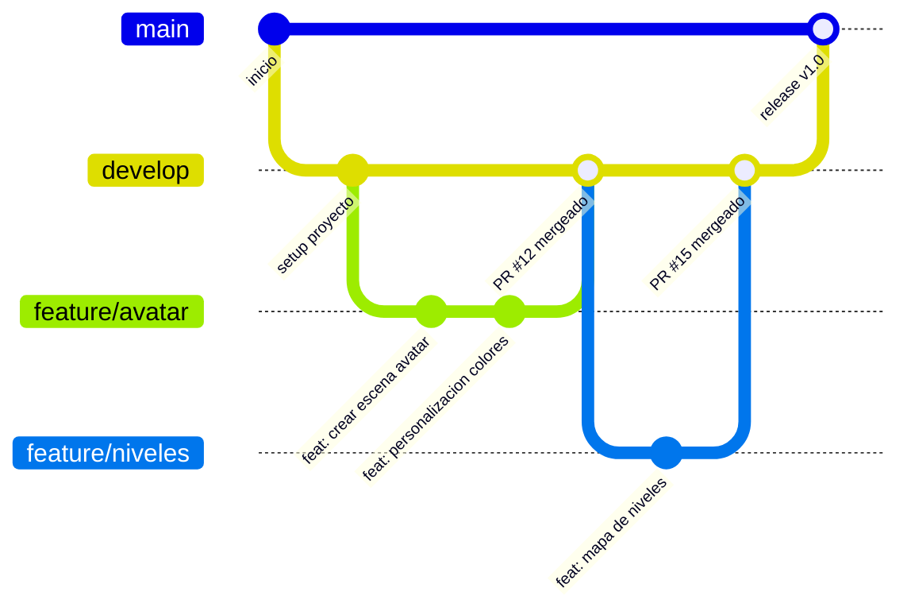

# Guía de Contribución – NiCarrera.Test

Este documento define el flujo de trabajo con Git que sigue el equipo: ramas, mensajes de commit, Pull Requests y trazabilidad.

---

## 1. Estrategia de Ramas

Usamos un flujo simplificado tipo GitFlow:

| Rama | Propósito |
|---|---|
| `main` | Código estable, listo para producción |
| `develop` | Rama de integración donde conviven las features en desarrollo |
| `feature/nombre-corto` | Una funcionalidad nueva (ej. `feature/avatar-personalizacion`) |
| `release/x.x` | Preparación de una versión antes de pasar a `main` |
| `hotfix/nombre` | Arreglo urgente directo sobre `main` |

**Convergencia entre ramas:**



Cada `feature/*` nace de `develop` y vuelve a `develop` únicamente a través de un Pull Request. `develop` converge a `main` cuando una versión está lista. Un `hotfix/*` nace de `main`, se corrige, se mergea a `main` **y también** a `develop` para no perder el fix.

---

## 2. Conventional Commits

Todo commit debe seguir el formato: `tipo: descripción corta`

| Tipo | Cuándo usarlo |
|---|---|
| `feat` | Nueva funcionalidad |
| `fix` | Corrección de un error |
| `docs` | Cambios solo en documentación |
| `style` | Formato, sin cambios de lógica |
| `refactor` | Cambio de código que no agrega función ni corrige bug |
| `test` | Agregar o corregir pruebas |
| `chore` | Tareas de mantenimiento (dependencias, configuración) |

**Ejemplos:**
```
feat: agregar pantalla de selección de nivel
fix: corregir cálculo de puntaje Holland
docs: actualizar README técnico
chore: actualizar dependencia de Phaser
```

---

## 3. Proceso de Pull Requests

1. Crear la rama `feature/*` desde `develop` actualizado.
2. Hacer commits siguiendo Conventional Commits.
3. Abrir un Pull Request hacia `develop` usando la plantilla del repositorio (`.github/PULL_REQUEST_TEMPLATE.md`).
4. El PR debe tener **al menos 1 revisión aprobada** antes de mergear.
5. Usar "Squash and merge" o "Merge commit" (evitar "Rebase" para mantener el historial claro).
6. Borrar la rama feature una vez mergeada.

---

## 4. Trazabilidad

Todo commit o Pull Request importante debe referenciar el Issue relacionado:

```
feat: agregar pantalla de resultados (#12)
```

En GitHub, usar palabras clave como `Closes #12` en la descripción del PR para que el Issue se cierre automáticamente al mergear.

---

## 5. Evidencia sugerida

Para dejar constancia del flujo funcionando, se recomienda:
- Crear al menos una rama `feature/*` real, con 2-3 commits usando Conventional Commits.
- Abrir un Pull Request hacia `develop` y mergearlo.
- Guardar una captura de `git log --graph --oneline --all` mostrando la convergencia de ramas.
