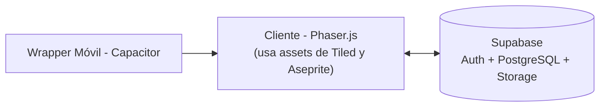

# README Técnico – NiCarrera.Test
 
Documentación técnica del proyecto para que cualquier persona del equipo pueda instalar, entender y ejecutar el proyecto sin depender de explicaciones verbales.
 
---
 
## 1. Descripción General
 
**NiCarrera.Test** es un videojuego 2D de orientación vocacional. El estudiante crea un avatar, recorre niveles respondiendo preguntas basadas en los modelos de Holland (RIASEC) y Thurstone, y recibe un reporte de carreras sugeridas al finalizar.
 
---
 
## 2. Arquitectura General
 
El proyecto sigue una arquitectura cliente–backend simple:
 

 
- **Cliente (Phaser.js):** contiene toda la lógica del juego, las escenas y la interfaz.
- **Backend (Supabase):** maneja autenticación, base de datos (PostgreSQL) y almacenamiento de assets/resultados.
- **Wrapper (Capacitor):** empaqueta el build web del juego como app nativa para Android/iOS.
---
 
## 3. Stack Tecnológico y Dependencias
 
| Herramienta | Uso |
|---|---|
| Phaser.js | Motor del juego (2D) |
| Supabase | Backend, autenticación y base de datos |
| Vite | Bundler / entorno de desarrollo |
| Capacitor | Wrapper para publicar en Android/iOS |
| Tiled | Diseño de mapas y niveles (exporta `.json`/`.tmj`) |
| Aseprite | Arte y animaciones (exporta `.png`/`.json`) |
 
Dependencias principales (`package.json`):
 
```json
{
  "dependencies": {
    "phaser": "^3.80.0",
    "@supabase/supabase-js": "^2.45.0"
  },
  "devDependencies": {
    "vite": "^5.4.0"
  }
}
```
 
> Ajustar las versiones exactas según lo que se instale en el proyecto real.
 
---
 
## 4. Variables de Entorno
 
Crear un archivo `.env` en la raíz (basado en `.env.example`, que sí se sube al repo):
 
```
VITE_SUPABASE_URL=https://tu-proyecto.supabase.co
VITE_SUPABASE_ANON_KEY=tu-anon-key-aqui
```
 
**Importante:** el archivo `.env` real nunca se sube al repositorio (agregarlo a `.gitignore`).
 
---
 
## 5. Estructura del Proyecto
 
```
/src
  /scenes        → Escenas de Phaser (BootScene, AvatarScene, LevelScene, ResultScene)
  /entities      → Clases del juego (Avatar, Pregunta, IntentoEvaluacion)
  /services      → Conexión y llamadas a Supabase (supabaseClient.js, authService.js)
  /assets
    /maps        → Mapas exportados desde Tiled
    /sprites     → Sprites y animaciones exportados desde Aseprite
  main.js        → Punto de entrada de Phaser
/docs
  /design        → Game Design Document (GDD)
  /architecture  → ER + los 3 diagramas UML (casos de uso, actividades, clases)
.env.example
package.json
```
 
---
 
## 6. Scripts Disponibles
 
| Comando | Descripción |
|---|---|
| `npm install` | Instala las dependencias |
| `npm run dev` | Levanta el entorno de desarrollo local |
| `npm run build` | Genera el build de producción |
| `npx cap sync` | Sincroniza el build con el proyecto nativo (Capacitor) |
 
---
 
## 7. Ejemplos de Endpoints (Supabase)
 
**Registro de usuario:**
```js
const { data, error } = await supabase.auth.signUp({ email, password });
```
 
**Consultar preguntas de un nivel:**
```js
const { data, error } = await supabase
  .from('Preguntas')
  .select('*')
  .eq('IdNivel', nivelActual);
```
 
**Guardar un intento de evaluación:**
```js
const { data, error } = await supabase
  .from('Intentos_Evaluaciones')
  .insert([{ IdUsuario: userId, Tipo_Evaluacion: 'Holland' }]);
```
 
---
 
## 8. Instalación y Ejecución Local
 
1. Clonar el repositorio.
2. Ejecutar `npm install`.
3. Copiar `.env.example` a `.env` y completar las credenciales de Supabase.
4. Ejecutar `npm run dev`.
---
 
## 9. Notas para producción
 
- Usar proyectos Supabase separados para desarrollo y producción.
- Antes de publicar, correr `npm run build` y luego `npx cap sync` para actualizar el proyecto nativo.
